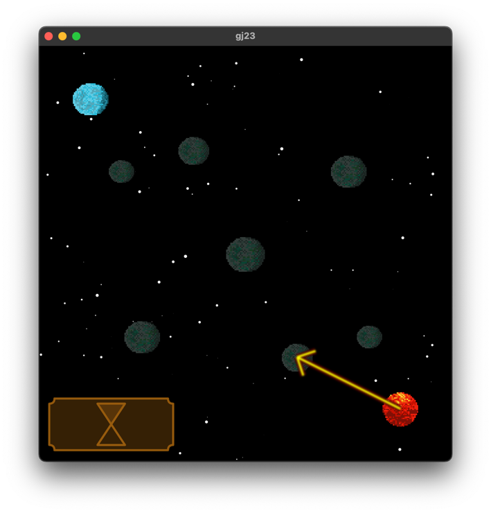
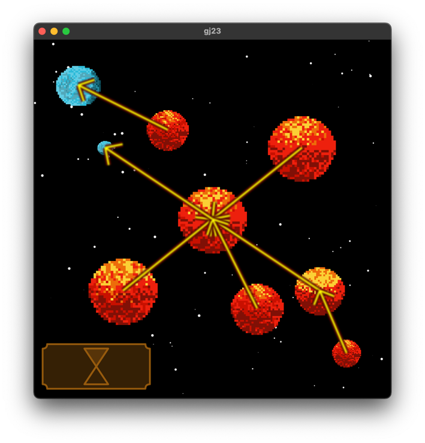

# Celsius vs Fahrenheit

This is a game submission for the 2023 Flame Game Jam. The theme was Cold/Hot,
and we made a game about the fight between the different ways to measure
temperature, just taken to epic proportions!

Between the limitations (No text, one button input or multiple endings) we
decided to let the temperature speak for itself, and kept texts out of the
game.

## The story
A long long time from now, in a galaxy quite near you, the eternal fight for
world domination between Anders Celsius and Daniel Gabriel Fahrenheit is still
ongoing.

As their influence grew on the small planet called Earth by some, Tellus by
others, they eventually realized the world was too small for them. They had to
expand, and the only direction to expand to was out. They started to look for
world domination in space.

In this game you play as (the objectively superior) Anders Celsius trying to
teach the whole universe that using the freezing and boiling point of water as
a reference for measuring temperature is the way to go.

Your goal is to preach the world of the superior system to all planets,
starting. You start with one planet, the planet where 100° means __HOT__, and not
_luke warm_. (_Read fire_)

## Playing the game

There are three different factions:

* Fire (Celsius): These planets are controlled by you, they want to preach the
  good word of freezing and boiling water.
* Neutral: These planets don't really care one way or the other (yet). They
  will never attack, but they will not take stance until enough preaching is done
  to convince them.
* Ice (Fahrenheit): These planets are controlled by the evil AI. They will do
  everything in their power to try to dominate the world. Watch out!

To start preaching, draw an arrow from one of your planets to a nearby planet.
That planet will send a thermos with some of the heat to that planet. If the
heat is enough to convince the planet it will become yours and will help
preaching the word of Celsius.

Once you have decided your moves, press the button shaped like an hour glass
in the bottom left corner.

Now it is time for Fahrenheit to decide on his move, and for the preaching to
commence. All thermoses will be sent, with hot and cold contents, from both
factions.

Once all preaching has been calculated and planets have decided who to follow
we enter a growth step. This is where cold planets become a bit colder (and
bigger) and where warm planets become hotter (and bigger).

Watch out as you might just deplete all faith from a planet, so keep an eye on
your planet's sizes.

This fight will continue like this until one faction is declared as the
preferred measuring scale by all planets that cares. If one faction loses all
its influence, the game is over.

## About the team

The team behind this game consists of Joel Ås, Sara Liljefors, Åland Sharyari,
Sally Meer and Johannes Pietilä Löhnn.